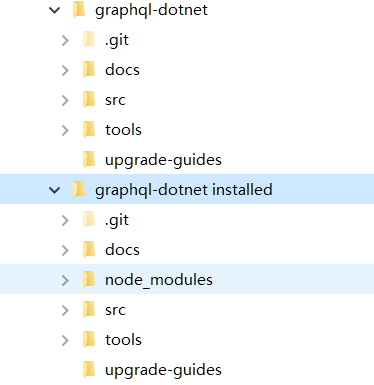

# graphql-dotnet 分析及学习

1. 项目地址：

  <https://github.com/graphql-dotnet/graphql-dotnet>

1. 获取源代码：

  `git clone https://github.com/graphql-dotnet/graphql-dotnet.git`

1. 项目初始化及安装：(如果没有 nodejs 和 yarn 请先自行安装)

  `yarn install`

  `yarn start`

1. 对比安装前后目录：
  
  项目目录下增加了 node_modules 是 nodejs 的包管理目录所有的公共包（库）都安装在这个目录下。
