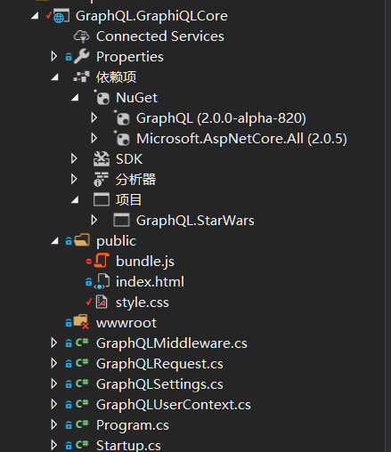

# graphql-dotnet 分析及学习

1. 项目地址：

<https://github.com/graphql-dotnet/graphql-dotnet>

1. 获取源代码：

```bush
git clone https://github.com/graphql-dotnet/graphql-dotnet.git`
```

1. 项目初始化及安装：(如果没有 nodejs 和 yarn 请先自行安装)

```bush
yarn install
yarn start
```

1. 对比安装前后目录：


项目目录下增加了 node_modules 是 nodejs 的包管理目录所有的公共包（库）都安装在这个目录下。


站点项目增加了 public 目录主要是生成界面的文件 bundle.js


1. 我们分析一下启动项目 GraphQL.GraphiQLCore



* Program.cs

```C#
    public class Program
    {

        public static void Main(string[] args)
        {
            BuildWebHost(args).Run();
        }

        public static IWebHost BuildWebHost(string[] args) =>
            WebHost.CreateDefaultBuilder(args)
                .UseStartup<Startup>()
                .UseWebRoot("public") //指定启动目录
                .Build();
    }
```

简单的代码，指定启动目录为 public，就是我们刚刚生成文件的目录。

* Startup.cs

```C#
public class Startup
    {
        public void ConfigureServices(IServiceCollection services)
        {
            services.AddSingleton<IDocumentExecuter, DocumentExecuter>();
            services.AddSingleton<IDocumentWriter, DocumentWriter>();

            //注入数据类型
            services.AddSingleton<StarWarsData>();
            services.AddSingleton<StarWarsQuery>();
            services.AddSingleton<StarWarsMutation>();
            services.AddSingleton<HumanType>();
            services.AddSingleton<HumanInputType>();
            services.AddSingleton<DroidType>();//机器人
            services.AddSingleton<CharacterInterface>();
            services.AddSingleton<EpisodeEnum>();//插曲
            services.AddSingleton<ISchema>(
                s => new StarWarsSchema(new FuncDependencyResolver(type => (GraphType)s.GetService(type))));

            services.AddSingleton<IHttpContextAccessor, HttpContextAccessor>();
        }

        public void Configure(IApplicationBuilder app, IHostingEnvironment env)
        {
            if(env.IsDevelopment())
            {
                app.UseDeveloperExceptionPage();
            }
            //拦截请求调用GraphQL
            app.UseMiddleware<GraphQLMiddleware>(new GraphQLSettings
            {
                BuildUserContext = ctx => new GraphQLUserContext
                {
                    User = ctx.User
                }
            });
            app.UseDefaultFiles();
            app.UseStaticFiles();
        }
    }
```

* GraphQLMiddleware.cs

```C#
public class GraphQLMiddleware
    {
        //处理HTTP请求的函数。
        private readonly RequestDelegate _next;
        //GraphQL设置
        private readonly GraphQLSettings _settings;
        //Schema执行
        private readonly IDocumentExecuter _executer;
        //Schema写入
        private readonly IDocumentWriter _writer;

        public GraphQLMiddleware(
            RequestDelegate next,
            GraphQLSettings settings,
            IDocumentExecuter executer,
            IDocumentWriter writer)
        {
            _next = next;
            _settings = settings;
            _executer = executer;
            _writer = writer;
        }

        /// <summary>
        /// 如果是GraphQL请求执行GraphQL请求，不是的话使用AspNetCore处理HTTP请求
        /// </summary>
        /// <param name="context"></param>
        /// <param name="schema"></param>
        /// <returns></returns>
        public async Task Invoke(HttpContext context, ISchema schema)
        {
            if (!IsGraphQLRequest(context))
            {
                await _next(context);
                return;
            }

            await ExecuteAsync(context, schema);
        }

        /// <summary>
        /// 判断是否是GraphQL请求
        /// </summary>
        /// <param name="context"></param>
        /// <returns></returns>
        private bool IsGraphQLRequest(HttpContext context)
        {
            return context.Request.Path.StartsWithSegments(_settings.Path)
                && string.Equals(context.Request.Method, "POST", StringComparison.OrdinalIgnoreCase);
        }

        /// <summary>
        /// 执行GraphQL请求
        /// </summary>
        /// <param name="context"></param>
        /// <param name="schema"></param>
        /// <returns></returns>
        private async Task ExecuteAsync(HttpContext context, ISchema schema)
        {
            string body;
            using (var streamReader = new StreamReader(context.Request.Body))
            {
                body = await streamReader.ReadToEndAsync().ConfigureAwait(true);
            }

            var request = JsonConvert.DeserializeObject<GraphQLRequest>(body);

            var result = await _executer.ExecuteAsync(_ =>
            {
                _.Schema = schema;
                _.Query = request.Query;
                _.OperationName = request.OperationName;
                _.Inputs = request.Variables.ToInputs();
                _.UserContext = _settings.BuildUserContext?.Invoke(context);
            });

            await WriteResponseAsync(context, result);
        }

        /// <summary>
        /// 获取执行结果
        /// </summary>
        /// <param name="context"></param>
        /// <param name="result"></param>
        /// <returns></returns>
        private async Task WriteResponseAsync(HttpContext context, ExecutionResult result)
        {
            var json = _writer.Write(result);

            context.Response.ContentType = "application/json";
            context.Response.StatusCode = result.Errors?.Any() == true ? (int)HttpStatusCode.BadRequest : (int)HttpStatusCode.OK;

            await context.Response.WriteAsync(json);
        }
    }
```

基本流程是截获 http 请求，如果不是 GraphQL 请求，直接调用 AspNetCore 处理，如果是调用 GraphQL 的 IDocumentExecuter 分析 Schema 并执行查询，查询完成返回 json 结果

我们执行一个这样的查询，看看请求的数据分别是那些值

```js
query
{
  heroes {
    id
    name
    friends{
      id
      name
    }
    appearsIn
  }
}
```

左侧请求数据作为 request.Query 数据传递到 IDocumentExecuter 进行分析

```json
{
  "data": {
    "heroes": [
      {
        "id": "1",
        "name": "Luke",
        "friends": [
          { "id": "3", "name": "R2-D2" },
          { "id": "4", "name": "C-3PO" }
        ],
        "appearsIn": ["NEWHOPE", "EMPIRE", "JEDI"]
      },
      {
        "id": "2",
        "name": "Vader",
        "friends": [],
        "appearsIn": ["NEWHOPE", "EMPIRE", "JEDI"]
      },
      {
        "id": "044c44bd-d35d-4765-82ac-dfe2ab2906c4",
        "name": "12345",
        "friends": [],
        "appearsIn": null
      },
      {
        "id": "3",
        "name": "R2-D2",
        "friends": [
          { "id": "1", "name": "Luke" },
          { "id": "4", "name": "C-3PO" }
        ],
        "appearsIn": ["NEWHOPE", "EMPIRE", "JEDI"]
      },
      {
        "id": "4",
        "name": "C-3PO",
        "friends": [],
        "appearsIn": ["NEWHOPE", "EMPIRE", "JEDI"]
      }
    ]
  }
}
```

返回的是 json 数据

1. 我们看看数据定义 GraphQL.StarWars

这是一个星战项目数据，星战迷请鼓掌
我们从Schema开始

* StarWarsSchema.cs

```C#
public class StarWarsSchema : Schema
    {
        public StarWarsSchema(IDependencyResolver resolver)
            : base(resolver)
        {
            Query = resolver.Resolve<StarWarsQuery>();
            Mutation = resolver.Resolve<StarWarsMutation>();
        }
    }
```

我们都知道GraphQL对应一个查询根节点，一个操作根节点，这里就分别对应这两个，下面我们先看看Query的根节点

* StarWarsQuery.cs

```C#
public class StarWarsQuery : ObjectGraphType<object>
    {
        public StarWarsQuery(StarWarsData data)
        {
            Name = "查询";
            //查询单个数据
            Field<CharacterInterface>("hero","获取一个随机英雄", resolve: context => data.GetHumanByIdAsync("1"));

            //查询列表
            Field<ListGraphType<CharacterInterface>>("heroes", "获取所有英雄信息", resolve: context => data.GetHeroes(true,true));

            //查询列表
            Field<ListGraphType<HumanType>>("humans","获取所有人类信息", resolve: context => data.GetHumans());

            //查询列表
            Field<ListGraphType<DroidType>>("droids","获取所有机器人信息", resolve: context => data.GetHeroes(false, true));

            //带参数查询
            Field<HumanType>(
                "human",
                arguments: new QueryArguments(
                    new QueryArgument<NonNullGraphType<StringGraphType>> { Name = "id", Description = "id of the human" }
                ),
                resolve: context => data.GetHumanByIdAsync(context.GetArgument<string>("id"))
            );

            //带参数查询列表
            Field<ListGraphType<CharacterInterface>>(
                "humansOrdroids",
                arguments: new QueryArguments(
                    new QueryArgument<NonNullGraphType<BooleanGraphType>> { Name = "isHuman", Description = "选是查人类否查机器人" }
                ),
                resolve: context => data.GetHeroes(context.GetArgument<bool>("isHuman"),!context.GetArgument<bool>("isHuman"))
            );

            //使用委托定义带参数查询
            Func<ResolveFieldContext, string, object> func = (context, id) => data.GetDroidByIdAsync(id);

            FieldDelegate<DroidType>(
                "droid",
                arguments: new QueryArguments(
                    new QueryArgument<NonNullGraphType<StringGraphType>> { Name = "id", Description = "id of the droid" }
                ),
                resolve: func
            );
        }
    }
```

请注意由于bundle.js限制不能使用中文，我这里修改了一下。可以对应下图对比一下：


```C#

```